# Growth India Enterprise Suite — Complete Admin User Manual

**Document Version:** 2.4.0 (Enterprise Production Edition)  
**Operating Stack:** Next.js 14 App Router, MongoDB Atlas Replica Set, Prisma ORM  
**Target Audience:** Platform Administrators, Operations Leads, HR Directors, and System Managers.

---

## Table of Contents

1. [Platform Architecture & Multi-Tenant Foundations](#1-platform-architecture--multi-tenant-foundations)
2. [System Authentication & Security Gateway](#2-system-authentication--security-gateway)
3. [Admin Governance Gateway & Navigation](#3-admin-governance-gateway--navigation)
4. [Admin Team & Delegated Governance](#4-admin-team--delegated-governance)
5. [CMS — Client Management System](#5-cms--client-management-system)
   - 5.1 [CMS Dashboard & System Telemetry](#51-cms-dashboard--system-telemetry)
   - 5.2 [Client Onboarding Wizard](#52-client-onboarding-wizard)
   - 5.3 [Clients Directory Master](#53-clients-directory-master)
   - 5.4 [Client-Specific Workforce Console (EMS)](#54-client-specific-workforce-console-ems)
6. [HRM — Human Resource Management Suite](#6-hrm--human-resource-management-suite)
   - 6.1 [HRM Command Center & Telemetry Dashboard](#61-hrm-command-center--telemetry-dashboard)
   - 6.2 [9-Stage Workforce Lifecycle Kanban](#62-9-stage-workforce-lifecycle-kanban)
   - 6.3 [Employee 360° Comprehensive Profile](#63-employee-360-comprehensive-profile)
   - 6.4 [Organization Architecture & Hubs](#64-organization-architecture--hubs)
   - 6.5 [Recruitment & ATS Talent Pipeline](#65-recruitment--ats-talent-pipeline)
   - 6.6 [Time & Biometric Attendance Telemetry](#66-time--biometric-attendance-telemetry)
   - 6.7 [Leave Ledger & Quotas](#67-leave-ledger--quotas)
   - 6.8 [Payroll & Statutory Compliance Engine](#68-payroll--statutory-compliance-engine)
   - 6.9 [Payslip Generation, Distribution & Ledger](#69-payslip-generation-distribution--ledger)
   - 6.10 [Performance Management (PMS) & OKR Tracking](#610-performance-management-pms--okr-tracking)
   - 6.11 [HR Helpdesk & Employee Requests](#611-hr-helpdesk--employee-requests)
7. [CRM — Commercial Sales & Deal Pipeline](#7-crm--commercial-sales--deal-pipeline)
8. [Master End-to-End Operational Workflows (SOPs)](#8-master-end-to-end-operational-workflows-sops)
9. [Troubleshooting Guide & Frequently Asked Questions (FAQs)](#9-troubleshooting-guide--frequently-asked-questions-faqs)

---

## 1. Platform Architecture & Multi-Tenant Foundations

The **Growth India Enterprise SaaS Platform** is a modern, high-performance, multi-tenant cloud application engineered to handle the complex operational requirements of Indian corporate enterprises and global businesses.

The platform integrates three core operating engines into a unified ecosystem:
1. **CMS (Client Management System):** Manages external corporate client organizations, their subscription tiers, feature access modules, and employee quota limits.
2. **HRM (Human Resource Management):** Governs applicant recruitment (ATS), employee 360° profiles, biometric attendance telemetry, leave ledgers, Indian statutory payroll (EPF, ESI, Professional Tax, TDS), quarterly appraisals (PMS), and internal helpdesks.
3. **CRM (Customer Relationship Management):** Streamlines enterprise sales pipelines, lead capturing, B2B company accounts, quotation drafting, and closed-won deal forecasting.

### Role-Based Access Control (RBAC) Matrix

| Role | Identifier | Operational Scope & Permissions |
| :--- | :--- | :--- |
| **Platform Super Admin** | `SUPER_ADMIN` / `ADMIN` | Unrestricted platform authority. Manages all client organizations, global system configuration, audit logs, and delegates admin invitations. |
| **Client Administrator** | `CLIENT` | Organization-level tenant owner. Manages company staff, internal departments, attendance policies, and client billing details. |
| **HR Manager** | `ADMIN_HR` | Executes talent acquisition (ATS), processes monthly payroll calculations, approves leaves, and regulates attendance anomalies. |
| **Team Manager** | `MANAGER` | Team leadership scope. Reviews assigned direct reportees, approves leave requests, reviews shift attendance, and conducts performance appraisals. |
| **Employee** | `EMPLOYEE` | Employee Self-Service (ESS). Performs daily check-in/out punches, requests leave, submits regularization tickets, and downloads payslips. |

### Strict Multi-Tenant Isolation
Every request across APIs and database queries validates tenant isolation server-side. Records belonging to Organization A are strictly segregated from Organization B, preventing cross-tenant data leakage even under direct API exploration.

---

## 2. System Authentication & Security Gateway

To access the central administration console, navigate to the secure gateway URL:  
🔗 **URL:** `http://localhost:3000/growthIndia` (or your company's production domain)

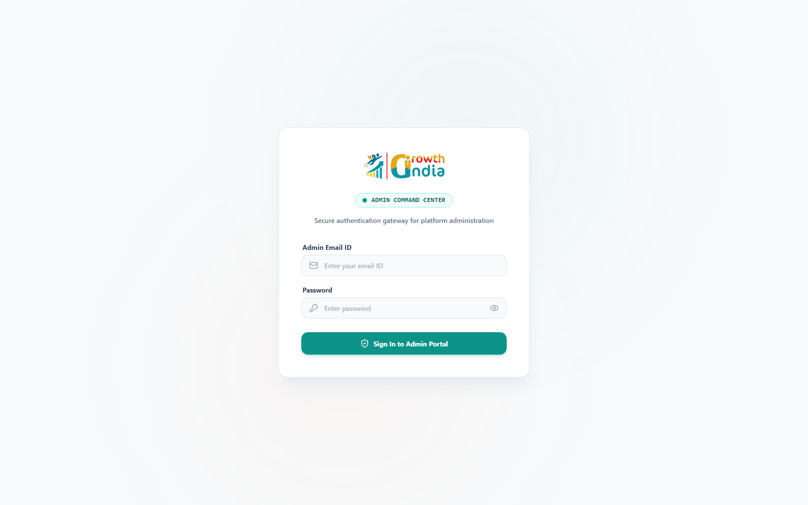

### Step-by-Step Login Procedure:
1. **Admin Email ID:** Enter your registered administrative email address (e.g., `admin@growthindia.co`).
2. **Password:** Enter your secure password (default: `Admin@123`).
3. Click the password visibility icon (eye) to verify character accuracy if needed.
4. Click the **"Sign In to Admin Portal"** button.
5. The backend validates your credentials using one-way salted `bcrypt` hashes. Upon verification, the server generates a cryptographically secure, HTTP-only cookie named `growth_session_token`.

> [!NOTE]
> If a non-administrative user (such as a standard employee or external client) attempts to sign in via this URL, the authentication middleware intercepts the session and automatically redirects them to their designated portal (`/client` or `/employee`).

---

## 3. Admin Governance Gateway & Navigation

Upon authenticating, administrators arrive at the **Admin Governance Center** (Operating Platform Gateway):

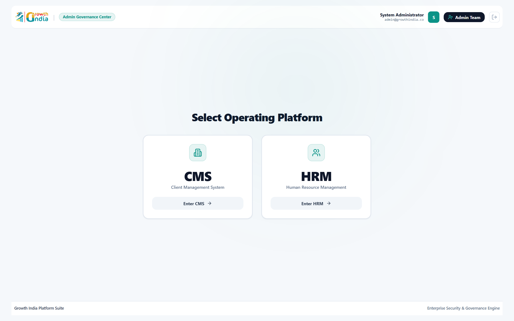

### Key Gateway Navigation Elements:
1. **Top Header Bar:**
   * **Growth India Logo:** Returns to the root landing interface.
   * **Admin Governance Center Badge:** Confirms an active administrative session.
   * **System Administrator Profile:** Displays the current logged-in admin identity and email.
   * **"Admin Team" Button:** Quick trigger to manage internal administrator invitations.
   * **Sign Out Icon:** Securely terminates the session and revokes the active token.
2. **Operating Platform Cards:**
   * **CMS (Client Management System):** Gateway to client organizations, subscription plans, and tenant billing. Click **"Enter CMS →"**.
   * **HRM (Human Resource Management):** Gateway to internal workforce operations, biometric logs, statutory payroll, and recruitment. Click **"Enter HRM →"**.
3. **Platform Switcher Dropdown:**  
   Located at the top-right of every sub-screen, this dropdown allows instantaneous switching between `CMS`, `HRM`, and `CRM` without requiring re-authentication.

---

## 4. Admin Team & Delegated Governance

Clicking the **"Admin Team"** button in the top navigation bar opens the administrative delegation modal:

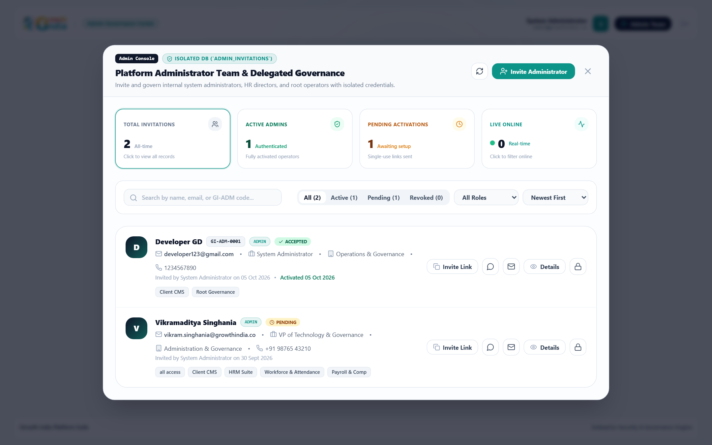

### Capabilities & Controls:
* **Live Telemetry Cards:**
   * **Total Invitations:** Cumulative count of administrative invites generated.
   * **Active Admins:** Administrators with verified, active access credentials.
   * **Pending Activations:** Unclaimed invitation links awaiting initial account setup.
   * **Live Online:** Real-time count of administrators currently connected to the console.
* **+ Invite Administrator:**
   * Click this button to invite a new HR Director, Operations Lead, or Co-Administrator.
   * Enter the candidate's Full Name, Official Email Address, Mobile Number, and Delegated Role (`SUPER_ADMIN`, `ADMIN_HR`, `OPERATOR`).
   * The platform generates a cryptographically random, single-use token embedded within a secure registration link.
* **Security Safeguards:**
   * Each invitation URL can be consumed exactly **once**.
   * To prevent token replay vulnerabilities, the invitation record immediately transitions to `ACCEPTED` upon account creation.

---

## 5. CMS — Client Management System

Selecting **"Enter CMS"** from the platform gateway opens the **Client Management Hub**:

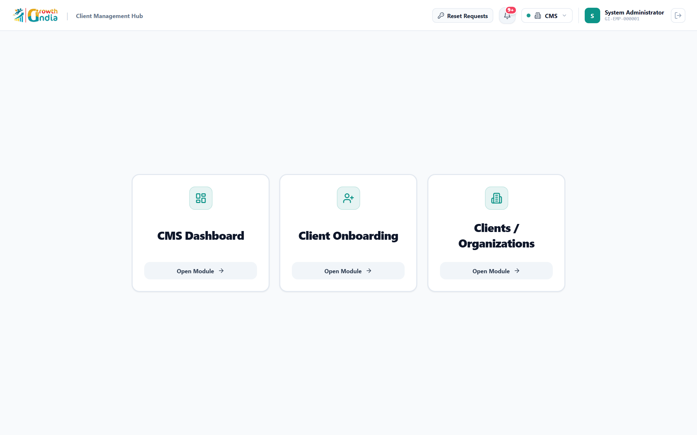

This command center provides three foundational administrative modules:
1. **CMS Dashboard:** Global client metrics, tenant utilization, and tier distributions.
2. **Client Onboarding:** A structured wizard for registering new enterprise clients.
3. **Clients / Organizations:** Master directory of all active and inactive corporate accounts.

---

### 5.1 CMS Dashboard & System Telemetry

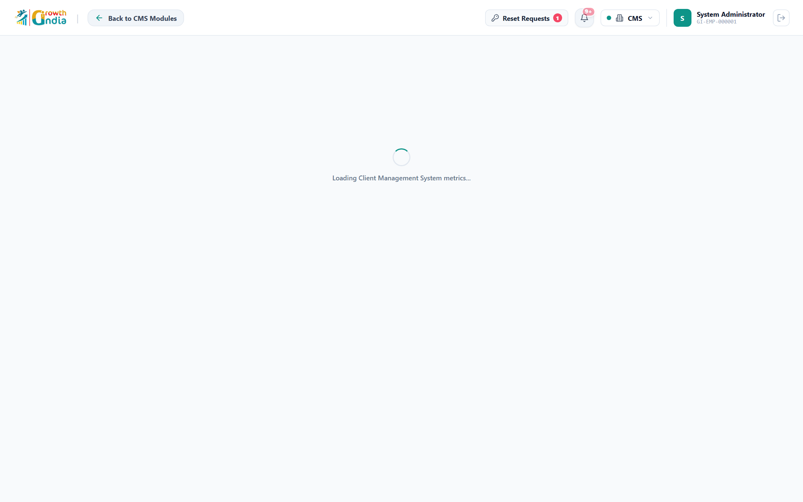

* **System Health & Resource Utilization:** Monitors active client organizations, active workforce counts, and server load distributions.
* **Revenue Tier Distribution:** Categorizes organizations across subscription plans (`STARTER`, `GROWTH`, `ENTERPRISE_PRO`).
* **Password Reset Requests:** The header includes a **"Reset Requests"** button that lets administrators review and resolve employee password lockouts in a single click.

---

### 5.2 Client Onboarding Wizard

To onboard a new enterprise client, click **Client Onboarding**:

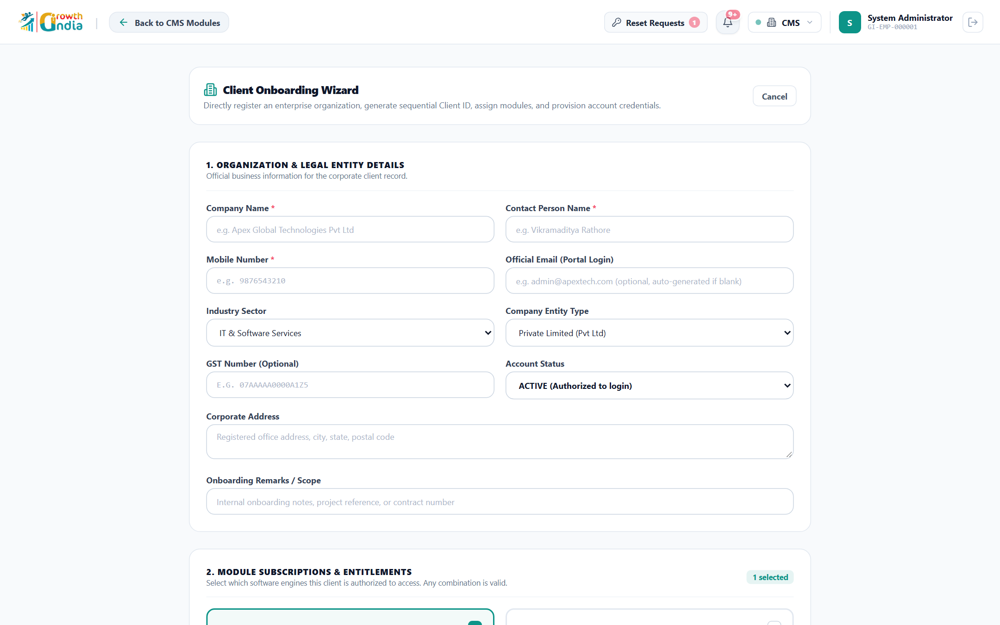

#### Structured Onboarding Steps:
1. **Legal Entity & Corporate Details:**
   * **Company Name *:** Full legal entity name (e.g., *Shree Cement Works Ltd*).
   * **Contact Person Name *:** Primary authorized liaison (e.g., Managing Director or Head of HR).
   * **Mobile Number *:** Direct contact phone number.
   * **Official Email (Portal Login):** Dedicated email used for client portal root access.
   * **Industry Sector:** Industry vertical (IT, Manufacturing, Logistics, Financial Services, etc.).
   * **Company Entity Type:** Private Limited, LLP, Partnership, Sole Proprietorship, etc.
   * **GST Number (Optional):** Goods and Services Tax Identification Number.
   * **Corporate Address:** Registered headquarters address.
2. **Software Module Subscriptions:**
   * Check the modules included in the client's commercial agreement:
     - `EMS` (Employee Management System)
     - `CRM` (Customer Relationship Management)
     - `ATTENDANCE` (Biometric Sync & Timesheet Engine)
     - `PAYROLL` (Statutory Salary & Compliance Engine)
3. **Employee Quota Limit:**
   * Set the maximum authorized headcount (`maxEmployees`, e.g., 100, 500, 1000). The backend strictly enforces this threshold, preventing client admins from onboarding staff beyond their licensed allotment.
4. **Account Creation:**
   * Submitting the form generates a unique tenant identifier (e.g., `CLI-00020`) and dispatches an automated setup email to the client admin.

---

### 5.3 Clients Directory Master

To review and manage all registered corporate entities, open **Clients / Organizations**:

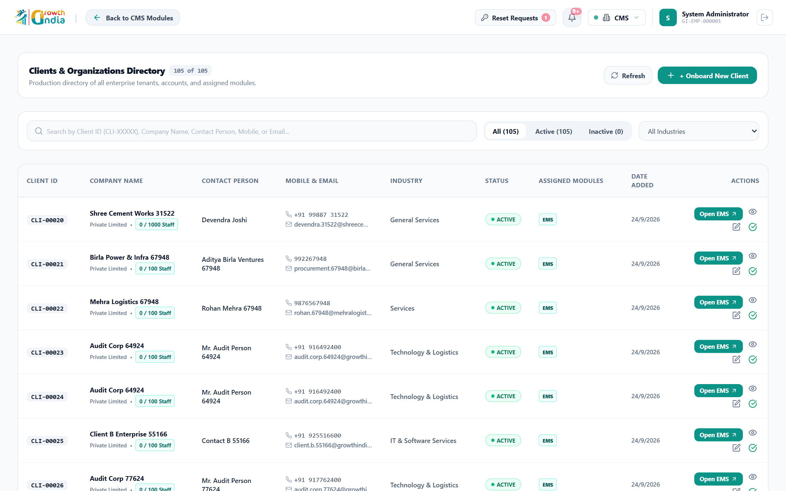

#### Grid Controls & Information:
* **Live Search Bar:** Instantly query by Client ID (`CLI-XXXXX`), Company Name, Contact Person, or Email.
* **Status Filter Tabs:** Switch between `All`, `Active`, and `Inactive` records.
* **Data Columns:**
   * **Client ID:** Permanent system-generated identifier.
   * **Company Name & Staff Usage:** Displays current enrolled workforce vs. maximum purchased capacity (e.g., `0 / 1000 Staff`).
   * **Contact Person:** Authorized representative details.
   * **Status Badge:** Visual indicator showing `ACTIVE` (emerald green) or `SUSPENDED` (crimson red).
   * **Assigned Modules:** Enabled functional suites (e.g., `EMS`, `CRM`).
* **Row Actions:**
   * **Open EMS ↗:** Launches the dedicated workforce management console for that client.
   * **View / Edit:** Allows updating corporate profile information, contact points, or subscription quotas.

---

### 5.4 Client-Specific Workforce Console (EMS)

Clicking **"Open EMS"** on any client row opens that client's isolated administrative environment:

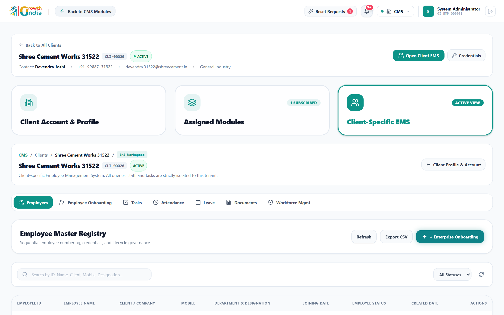

#### Available Sub-Views:
* **Client Account & Profile:** Corporate registration details, tax identifiers, and contact points.
* **Assigned Modules:** Enables or disables licensed feature suites in real time.
* **Client-Specific EMS:**
   * **Employees:** Master list of all staff members enrolled under this specific organization.
   * **+ Enterprise Onboarding:** Directly enroll new employees under this tenant.
   * **Attendance:** Live punch logs and biometric timesheet records for the client's staff.
   * **Leave:** Pending and historical leave applications submitted by client employees.
   * **Tasks:** Delegation board for assigning internal project responsibilities.
   * **Export CSV:** Exports complete workforce records to an Excel-compatible CSV file.

---

## 6. HRM — Human Resource Management Suite

Selecting **"HRM Suite"** from the platform switcher opens the internal human resources operating console:

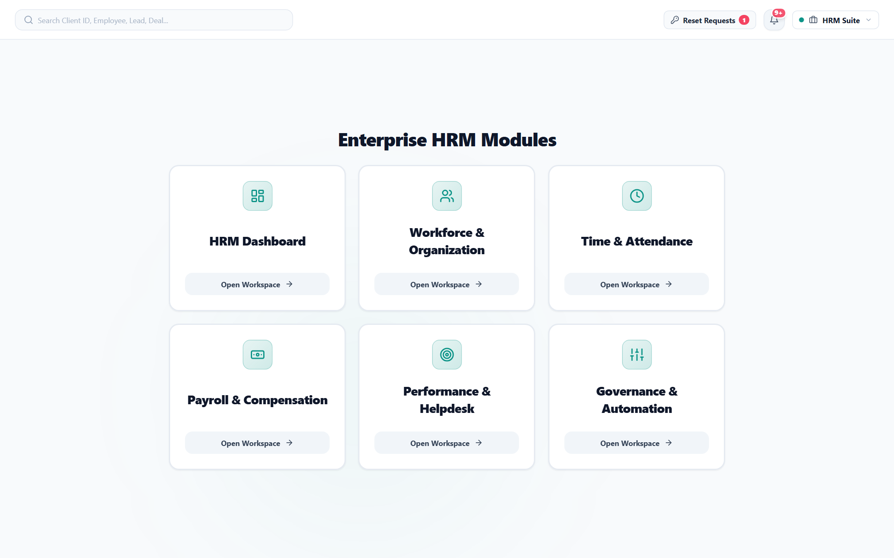

The HRM Suite is structured into 6 primary operational domains:
1. **HRM Dashboard:** Executive KPIs, live workforce telemetry, and payroll liabilities.
2. **Workforce & Organization:** 9-stage lifecycle Kanban, 360° employee profiles, branches, and applicant tracking (ATS).
3. **Time & Attendance:** Real-time biometric punch logs, shift schedules, and regularization approvals.
4. **Payroll & Compensation:** 5-step statutory payroll calculation, compliance deductions, and payslip distribution.
5. **Performance & Helpdesk:** Quarterly OKR tracking, appraisal workflows, and internal ticketing.
6. **Governance & Automation:** Approval chains, policy parameters, and audit logging.

---

### 6.1 HRM Command Center & Telemetry Dashboard

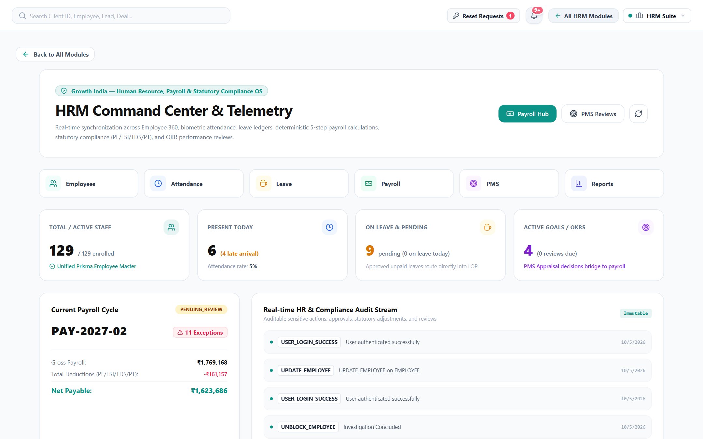

#### Real-Time Telemetry Cards:
* **Total / Active Staff (129 / 129 Enrolled):** Total headcount currently enrolled in the internal organization.
* **Present Today (6, 4 Late Arrival):** Real-time count of staff who completed biometric punch-ins, including late check-ins.
* **On Leave & Pending (9 Pending):** Staff members currently on leave alongside pending applications awaiting review.
* **Active Goals / OKRs (4 Active):** High-priority organizational objectives currently being tracked.
* **Current Payroll Cycle Snapshot (PAY-2027-02):**
   * Operational Status: `PENDING_REVIEW`
   * Gross Payroll Liability: `₹1,769,168`
   * Cumulative Deductions: `-₹161,157`
   * Net Payable Disbursement: `₹1,623,686`
* **Real-time HR & Compliance Audit Stream:**
   * An immutable, timestamped record documenting every administrative action (profile modifications, status updates, payroll reviews).

---

### 6.2 9-Stage Workforce Lifecycle Kanban

To oversee employee transitions from hire to departure, open **Workforce & Organization**:

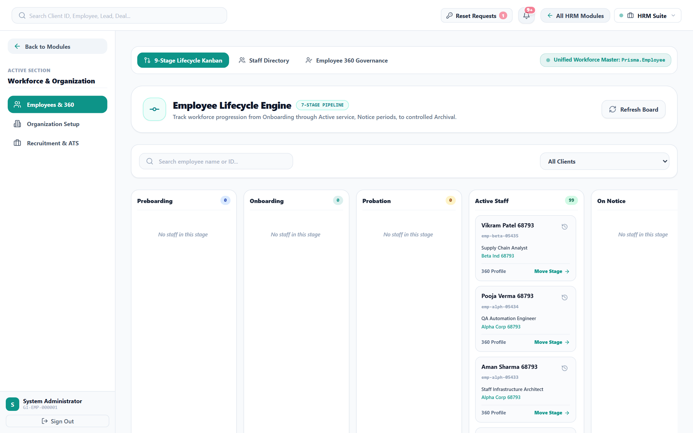

#### The 9 Standard Lifecycle Stages:
1. **Preboarding:** Offer accepted; document submission and background verification underway.
2. **Onboarding:** IT asset allocation, account creation, and orientation in progress.
3. **Probation:** Initial trial assessment period (typically 3 to 6 months).
4. **Active Staff:** Fully confirmed permanent workforce members.
5. **On Notice:** Formal resignation submitted; serving statutory notice period.
6. **Resigned:** Notice period completed; pending final clearance.
7. **Relieved:** No-dues certification signed, assets returned, and exit letters issued.
8. **Retired:** Superannuated staff with pension/gratuity settlements completed.
9. **Terminated:** Disciplinary separation or performance-based exit.

> [!TIP]
> To advance an employee to the next stage, click **"Move Stage →"** on their card. The platform automatically updates the database and triggers appropriate lifecycle workflows.

---

### 6.3 Employee 360° Comprehensive Profile

Clicking **"360 Profile"** on any employee card reveals their complete master file:

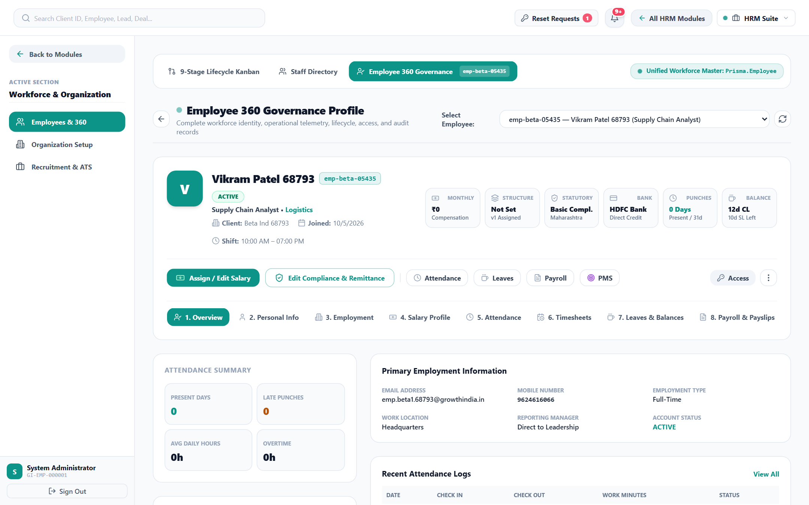

#### Comprehensive Profile Sub-Tabs:
1. **Overview:** Summary card with official ID (`emp-beta-05435`), designation, department, joining date, standard shift timings (`10:00 AM - 07:00 PM`), and current attendance status.
2. **Personal Info:** Residential address, blood group, emergency contact details, PAN, and Aadhaar numbers.
3. **Employment:** Reporting manager hierarchy, assigned operating branch, and employment contract type.
4. **Salary Profile:** Annual CTC, monthly gross, basic component breakdown, special allowances, and statutory eligibility flags (PF/ESI).
5. **Attendance:** Monthly biometric punch logs, shift adherence data, and total working hours.
6. **Timesheets:** Project work logs, billable tracking, and logged overtime hours.
7. **Leaves & Balances:** Real-time balances across Casual Leave (CL), Earned Leave (EL), and Sick Leave (SL).
8. **Payroll & Payslips:** Complete history of processed monthly payslips.

#### Direct Administrative Actions:
* **Assign / Edit Salary:** Reconfigures monthly compensation and component percentages.
* **Edit Compliance & Remittance:** Updates bank account details, IFSC code, and statutory UAN/ESI numbers.
* **Access Control:** Triggers an immediate password reset or suspends account login privileges.

---

### 6.4 Organization Architecture & Hubs

To configure corporate branches, departments, and designations, navigate to **Organization Setup**:

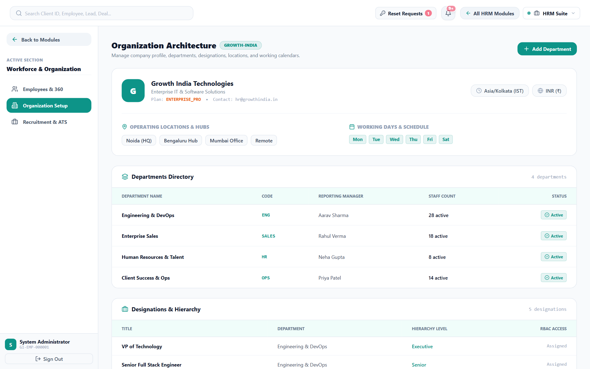

#### Core Configuration Components:
* **Operating Locations & Hubs:**
   * Noida (HQ), Bengaluru Tech Center, Mumbai Corporate Office, Remote.
   * Add new branches with complete address details and geolocation boundaries.
* **Working Schedule & Business Hours:**
   * Working days (e.g., Monday through Saturday), shift durations, and weekend policies.
* **Departments Directory:**
   * *Engineering & DevOps* (Code: `ENG`, 28 Active Staff)
   * *Enterprise Sales* (Code: `SALES`, 18 Active Staff)
   * *Human Resources & Talent* (Code: `HR`, 8 Active Staff)
   * *Client Success & Ops* (Code: `OPS`, 14 Active Staff)
   * Click **"+ Add Department"** to define new business units.
* **Designations & Hierarchy:**
   * Defines roles (VP of Technology, Senior Full Stack Engineer, QA Architect) and seniority levels (Executive, Senior, Mid, Entry).

---

### 6.5 Recruitment & ATS Talent Pipeline

To manage the hiring process from posting to conversion, open **Recruitment & ATS**:

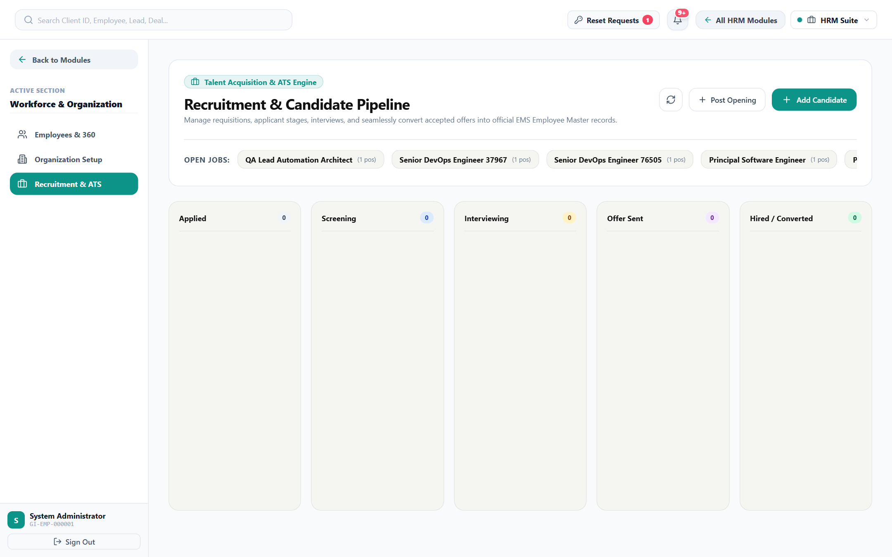

#### End-to-End Talent Pipeline Stages:
1. **+ Post Opening:** Create a new job requisition specifying role title, target department, required experience, and salary range.
2. **+ Add Candidate:** Register applicant profiles, attach CV documents, and record initial contact information.
3. **Kanban Pipeline Stages:**
   * **Applied:** Newly received candidate applications.
   * **Screening:** Initial resume review and qualification check.
   * **Interviewing:** Technical, managerial, and culture evaluation rounds.
   * **Offer Sent:** Formal offer letter issued with proposed CTC.
   * **Hired / Converted:** Once the offer is accepted, a single click converts the candidate directly into an active record within the **Employee Master (EMS)**!

---

### 6.6 Time & Biometric Attendance Telemetry

To track daily employee presence, punch times, and shift compliance, open **Time & Attendance**:

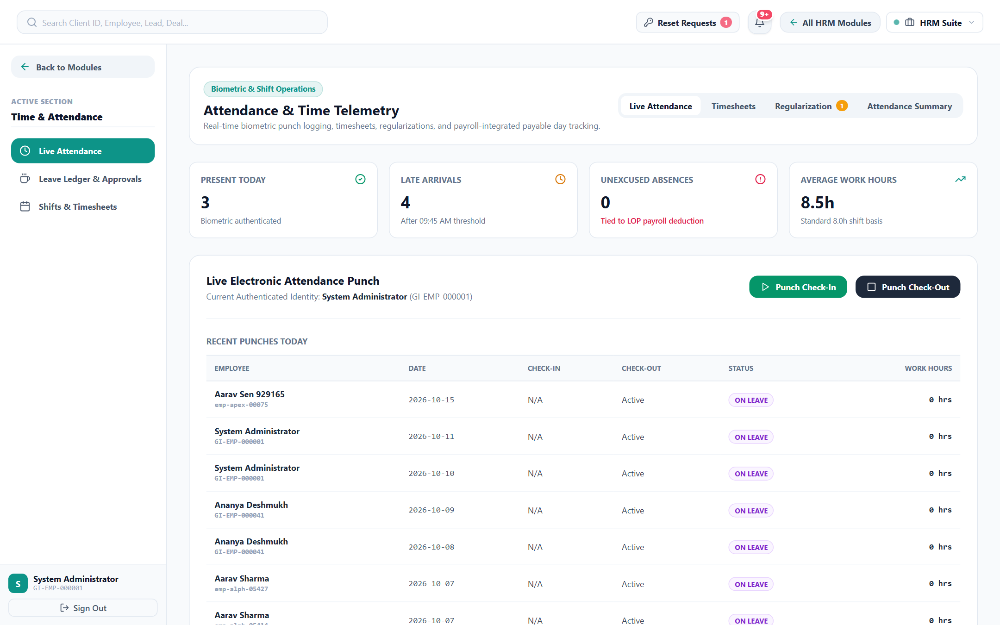

#### Key Operational Features:
* **Digital Punch Clock:**
   * **Punch Check-In:** Records arrival timestamp.
   * **Punch Check-Out:** Records departure timestamp and computes net hours worked.
* **Telemetry Metrics:**
   * **Present Today:** Total verified biometric check-ins for the day.
   * **Late Arrivals:** Check-ins recorded after the shift grace threshold (e.g., post 09:45 AM).
   * **Unexcused Absences:** Unscheduled absences that trigger automatic Loss of Pay (LOP) calculations during payroll runs.
   * **Average Work Hours:** Rolling daily average hours worked across active teams (benchmark: 8.5 hours).
* **Regularization Requests:**
   * If an employee misses a biometric punch due to network or field issues, they submit a regularization request explaining the discrepancy.
   * Administrators can **Approve** or **Reject** the request with one click, automatically updating the attendance ledger.

---

### 6.7 Leave Ledger & Quotas

To administer annual leave policies, balances, and employee time-off requests, open **Leave Ledger & Approvals**:

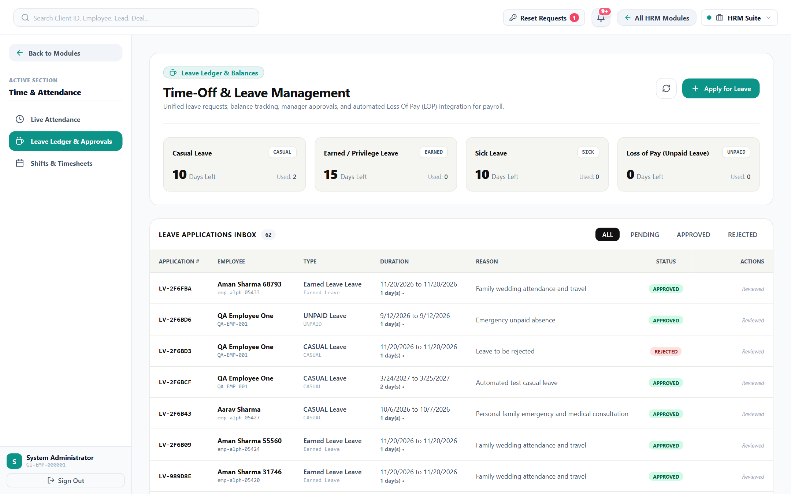

#### Leave Categories & Balance Tracking:
* **Casual Leave (CL):** 10 Days Available (short-term personal leave).
* **Earned / Privilege Leave (EL):** 15 Days Available (accrued paid annual leave).
* **Sick Leave (SL):** 10 Days Available (medical and health leave).
* **Loss of Pay (LOP):** Unpaid absence (each day approved reduces monthly payable salary).

#### Leave Applications Inbox:
* Review pending requests detailing applicant name, leave type, date range (e.g., `11/20/2026 to 11/20/2026 • 1 day`), and reason.
* Click **"Approve"** to grant the leave, deducting days from the employee's ledger and recording the absence in the calendar.
* Click **"Reject"** to decline the request with an explanation note.

---

### 6.8 Payroll & Statutory Compliance Engine

Payroll is a critical financial process within the platform, driven by a **5-step automated calculation engine**:

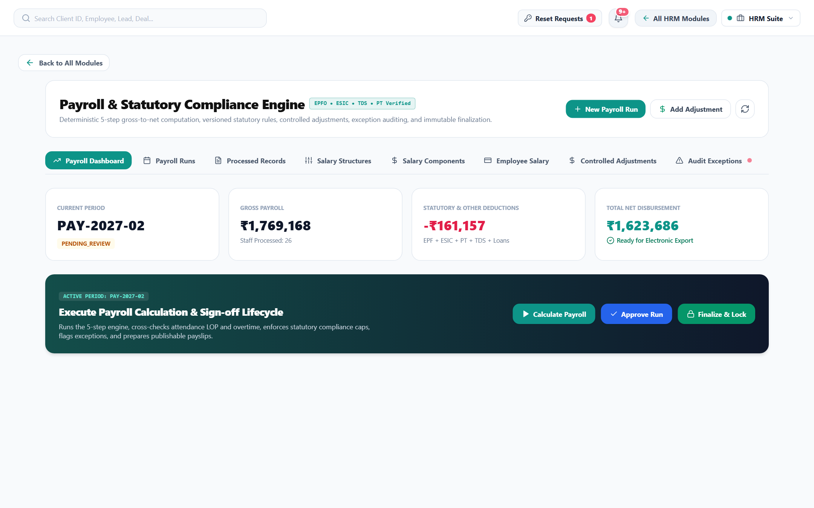

#### The 5-Step Payroll Lifecycle:
1. **Select Period:** Choose target payment month and year (e.g., `PAY-2027-02`).
2. **Fetch Data:** Aggregates employee CTC profiles, 30-day biometric logs, approved LOP days, and active loan EMI deductions.
3. **Calculate Payroll:** Click **"Calculate Payroll"** to execute statutory earnings and deduction calculations across all eligible employees.
4. **Approve Run:** Payroll administrators review discrepancy reports under the Audit Exceptions tab before clicking **"Approve Run"**.
5. **Finalize & Lock:** Clicking **"Finalize & Lock"** permanently seals the payroll run, creating immutable financial records and generating official payslips.

#### Indian Statutory Deductions Reference:
* **Employee Provident Fund (EPF - 12%):** Deducted at 12% of `Basic + DA`, capped at a statutory ceiling of ₹15,000 (**₹1,800.00** maximum per month).
* **Employee State Insurance (ESI - 0.75%):** Applies when monthly gross salary is $\le ₹21,000$. Employee contribution: `0.75%`; employer contribution: `3.25%`. Zero deduction if gross exceeds ₹21,000.
* **Professional Tax (PT):** State-specific monthly slabs (e.g., ₹200.00 per month in Maharashtra/Karnataka).
* **TDS (Income Tax):** Monthly estimated withholding based on annual income tax slab calculations.
* **Loss of Pay (LOP) Proration Formula:**
  $$\text{Per-Day Deduction} = \left(\frac{\text{Monthly Gross Salary}}{30}\right) \times \text{LOP Days}$$

---

### 6.9 Payslip Generation, Distribution & Ledger

Once payroll is locked, official payslips appear under the **Processed Records** tab:

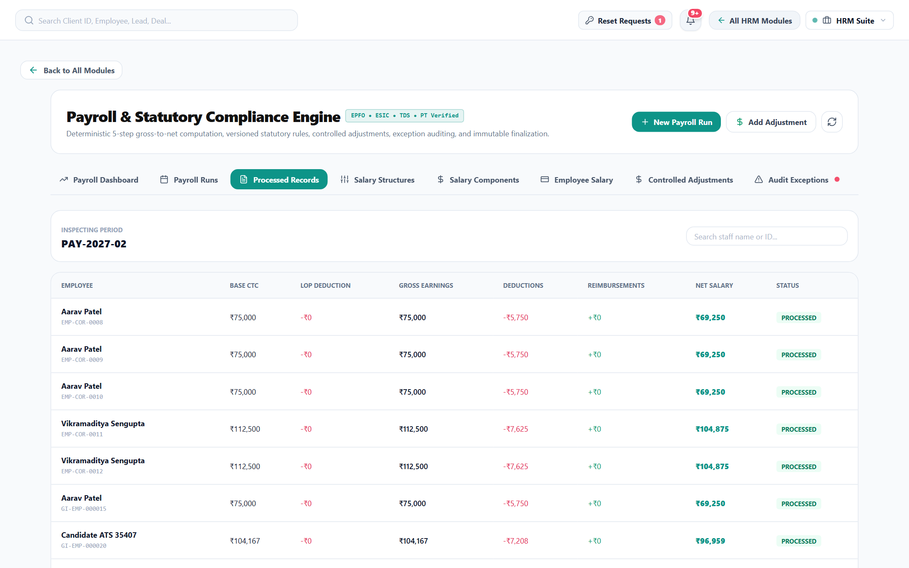

#### Payroll Ledger Data Columns:
* **Employee:** Name and official employee code.
* **Base CTC:** Fixed annual compensation structure.
* **LOP Deduction:** Calculated deduction for unexcused absences.
* **Gross Earnings:** Total earned compensation for the month.
* **Deductions:** Sum of PF, ESI, Professional Tax, TDS, and loan repayments.
* **Net Salary:** Final net amount disbursed to the employee's bank account.

#### Payslip Review & Distribution:
* Click **"View Slip"** to inspect a detailed statement including currency values in words using the Indian numbering system (*"Sixty-Nine Thousand Two Hundred Fifty Rupees Only"*).
* Employees can immediately view and download their PDF payslips through their self-service portal (ESS).

---

### 6.10 Performance Management (PMS) & OKR Tracking

To run employee goal cycles and performance reviews, open **Performance & Helpdesk** $\to$ **PMS & Performance**:

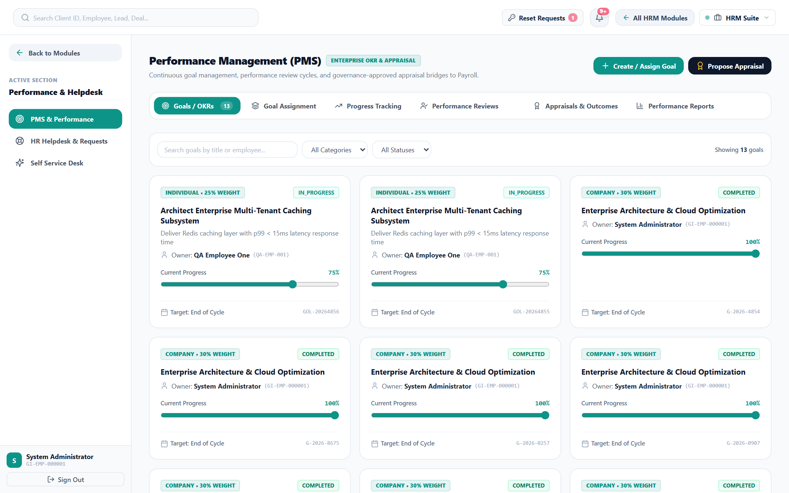

* **Goals / OKRs:** Establish high-level organizational objectives and cascade them to individual key results.
* **Weightage & Progress:** Track goals by assigned weight (e.g., 25%, 30%) with visual completion percentage bars.
* **Propose Appraisal:** Following review cycles, managers submit merit ratings and recommend compensation increments (%), which automatically flow into subsequent payroll runs upon approval.

---

### 6.11 HR Helpdesk & Employee Requests

To address internal employee requests and workplace tickets, open **HR Helpdesk & Requests**:

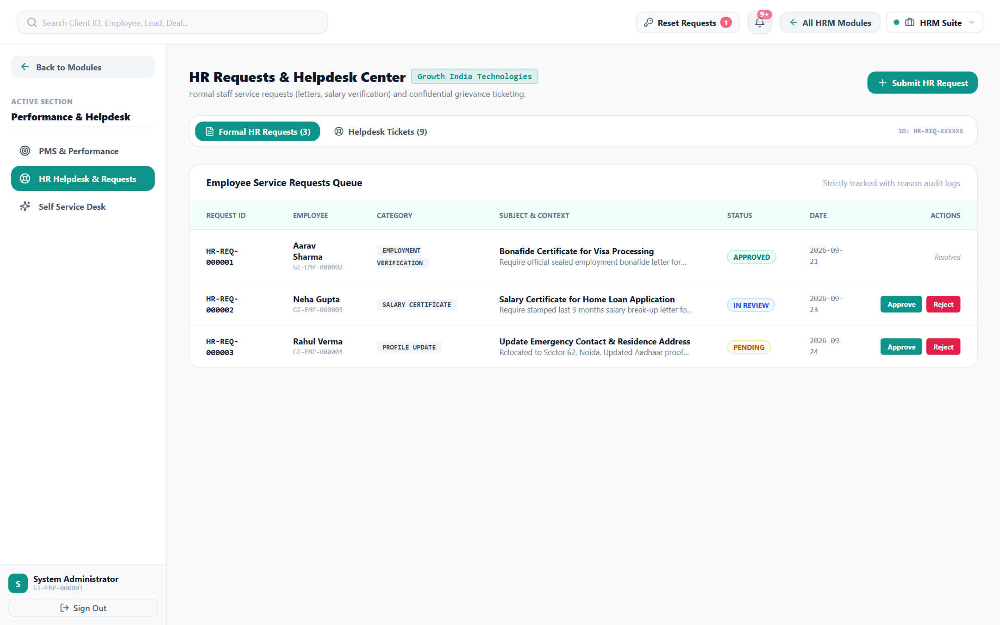

* **Formal HR Documentation Requests:**
   * *Bonafide Certificate for Visa Processing*
   * *Salary Certificate for Home Loan Application*
   * *Residential Address & Contact Detail Update*
   * Administrators review and resolve requests with a single click (**Approve** / **Reject**).
* **Internal Helpdesk Tickets:**
   * Manages hardware issues, payroll discrepancies, and workplace grievances.
   * Tracked by priority tier (High, Medium, Low) with built-in SLA timers for resolution tracking.

---

## 7. CRM — Commercial Sales & Deal Pipeline

Selecting **"CRM Sales"** from the platform switcher opens the enterprise sales management console:

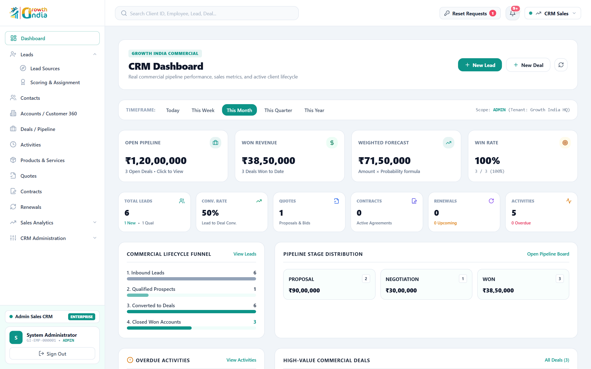

### Commercial Dashboard Metrics:
* **Open Pipeline (₹1,20,00,000):** Aggregate value of active commercial opportunities across all open stages.
* **Won Revenue (₹38,50,000):** Revenue secured from successfully closed deals in the current quarter.
* **Weighted Forecast (₹71,50,000):** Probability-weighted expected revenue based on deal pipeline stages.
* **Win Rate (100%):** Ratio of closed-won opportunities to total resolved deals.
* **Commercial Lifecycle Funnel:**
  $$\text{Inbound Leads (6)} \longrightarrow \text{Qualified Prospects (1)} \longrightarrow \text{Converted Deals (6)} \longrightarrow \text{Closed Won Accounts (3)}$$
* **Pipeline Stage Distribution:**
   * **Proposal:** ₹90,00,000 (2 Opportunities)
   * **Negotiation:** ₹30,00,000 (1 Opportunity)
   * **Won:** ₹38,50,000 (3 Accounts)

### Sales Sidebar Modules:
* **Leads:** Capture inbound inquiries, record lead sources, and assign opportunities to sales representatives.
* **Contacts & Accounts:** Central directory of client organizations, corporate decision-makers, and key stakeholders.
* **Deals / Pipeline:** Drag-and-drop Kanban board for advancing opportunities through deal stages.
* **Quotes & Contracts:** Build formal commercial proposals and generate PDF contracts for client review.

---

## 8. Master End-to-End Operational Workflows (SOPs)

### Workflow 1: Onboarding a New Corporate Client
1. From the top platform switcher, select **CMS** $\to$ click **Client Onboarding**.
2. Fill in Company Name, Contact Person Name, Email, Mobile Number, and Industry.
3. Check the licensed software modules (`EMS`, `ATTENDANCE`, `PAYROLL`).
4. Enter the maximum employee headcount limit (e.g., `500`).
5. Submit the form. The platform generates a unique tenant code (`CLI-XXXXX`) and emails setup instructions to the client administrator.
6. Open **Clients / Organizations** and click **"Open EMS"** on the new client to begin configuring their workforce.

---

### Workflow 2: Enrolling and Setting Up a New Employee
1. Navigate to **HRM Suite** $\to$ **Workforce & Organization** $\to$ **Employees & 360**.
2. Click the **"+ Enterprise Onboarding"** button.
3. Enter the employee's Full Name, Email, Mobile Number, Designation, and Department.
4. Assign a Reporting Manager.
5. Enter compensation details (Annual CTC, Basic Salary, Allowances) and bank account numbers.
6. Submit the form. The employee record enters the **Preboarding / Onboarding** lifecycle stage with generated portal credentials.

---

### Workflow 3: Running Monthly Payroll and Issuing Payslips
1. At the end of the pay cycle, navigate to **HRM Suite** $\to$ **Payroll & Compensation**.
2. Click **"+ New Payroll Run"** and select the target month (e.g., `2027-02`).
3. Click **"Calculate Payroll"**. The engine analyzes 30-day biometric attendance logs, deducts LOP days, calculates statutory taxes (PF, ESI, PT), and derives net payable amounts.
4. Review the **"Audit Exceptions"** tab to check for missing bank or tax information.
5. Click **"Approve Run"** to sign off on the calculations.
6. Click **"Finalize & Lock"**. The run is permanently locked, and individual payslips are published to the **Processed Records** tab and employee self-service portals.

---

### Workflow 4: Processing Leave and Regularization Requests
1. Navigate to **HRM Suite** $\to$ **Time & Attendance**.
2. Open the **Regularization** tab to review missed punch requests submitted by employees.
3. Click **Approve** to accept an explanation, which updates the punch log and removes any associated LOP deduction.
4. Navigate to **Leave Ledger & Approvals** to review formal leave requests.
5. Click **Approve** to debit the requested days from the employee's leave balance and update the attendance calendar.

---

### Workflow 5: Capturing a Lead and Closing an Enterprise Deal
1. Switch to **CRM Sales** via the top platform switcher $\to$ click **Leads**.
2. Click **"+ Add Lead"** and record inquiry details and source channel.
3. Once qualified, click **"Convert to Deal"** to move the opportunity into the active sales pipeline.
4. Drag the deal card across the Kanban board through **Discovery**, **Proposal**, and **Negotiation**.
5. Generate a formal commercial quotation under **Quotes & Contracts**.
6. When the client signs the contract, move the deal to **Closed Won**. The platform updates revenue metrics and pipeline forecasts automatically.

---

## 9. Troubleshooting Guide & Frequently Asked Questions (FAQs)

### Q1: An employee forgot their login password. How do I restore their access?
* **Solution:** Check the **"Reset Requests"** notification in the top header. If the employee submitted a request, click **"Reset Password"** to generate new credentials. Alternatively, open their **360 Profile** $\to$ **Access Control** tab and initiate a direct password reset.

### Q2: An employee missed a biometric punch. How do I prevent incorrect salary deductions?
* **Solution:** The employee must submit a **Regularization Request** through their self-service portal. An administrator then opens **Time & Attendance** $\to$ **Regularization** and clicks **Approve**. The day is marked present, preventing automated LOP deductions during payroll processing.

### Q3: Can a finalized payroll cycle be modified or recalculated?
* **Solution:** **No.** To uphold financial compliance, statutory auditability, and accounting integrity, any payroll run marked `FINALIZED` is permanently locked and immutable. If an adjustment is necessary, click **"Add Adjustment"** during the next monthly payroll run to process retroactive arrears or balance deductions.

### Q4: Can administrators of Client A view employees or data from Client B?
* **Solution:** **Strictly no.** The Growth India platform implements multi-tenant isolation at the database and API query levels. Every database interaction enforces tenant validation, ensuring that organizations can only access their own records.

---

**© Growth India Technologies — Enterprise Platform Operations Manual**  
*All rights reserved. Confidential and proprietary documentation for internal administrative use.*
