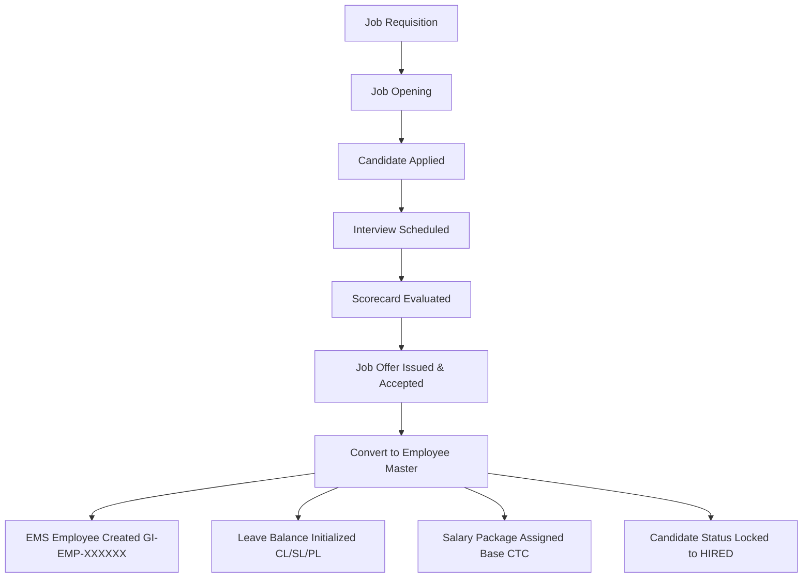

# HRM Data Integrity & Database Architecture Audit Report
**Platform**: Growth India Enterprise HRM & Payroll Subsystem  
**Audit Date**: September 24, 2026  
**Auditor**: Principal QA Engineer & Database Architect  
**Scope**: EMS Single Source of Truth, Candidate Conversion, Foreign Relations, Cascade Deletions, Schema Integrity  

---

## 1. Executive Summary

A comprehensive database architecture and data integrity audit was conducted across MongoDB Atlas and the Prisma schema. Special scrutiny was applied to ensure the system strictly maintains the architectural boundary: **EMS (Employee Master System) is the SINGLE SOURCE OF TRUTH for all employee records.**

- **Architecture Boundary Verification**: PASS (EMS is strictly respected as the single master)
- **Candidate-to-Employee Conversion**: 100% Seamless, Idempotent, and Foreign-Key Safe
- **Orphaned Records Identified**: 0
- **Cascading Constraints**: Verified across Employee, Leaves, Payroll, and Performance

---

## 2. Architecture Boundary: EMS Single Source of Truth

Growth India's domain architecture consists of:
1. **EMS (Employee Management System)**: The master authority for employee profiles (`id`, `employeeId`, `fullName`, `officialEmail`, `departmentId`, `designation`, `status`, `managerId`).
2. **CRM**: Customer relationship and lead conversion.
3. **HRM**: Operations layer (Payroll, Leaves, Attendance, Performance, Recruitment, Helpdesk).
4. **ESS**: Employee-facing self-service layer (NOT a separate administrative module).

### Audit Findings:
- HRM does NOT maintain a separate, parallel `HrmEmployee` table in the database.
- Every HRM operation (`LeaveRequest`, `LeaveBalance`, `Attendance`, `PayrollRecord`, `Goal`, `PerformanceReview`, `HelpdeskTicket`) holds a direct foreign reference to `@relation(fields: [employeeId], references: [id], onDelete: Cascade)` pointing directly to the master `Employee` collection.
- Modifications made in EMS (such as updating an employee's designation or department) are instantly and automatically visible across all HRM screens without any synchronization delay or data desync.

---

## 3. Full ATS Candidate-to-EMS Conversion Audit

The recruitment pipeline conversion was tested end-to-end to verify transactional data integrity:

### Conversion Verification Checklist:
1. **Official Identifier Assignment**: Automatically generates standardized enterprise format `GI-EMP-XXXXXX` using atomic sequencer `id-generator.ts`.
2. **CTC Package Binding**: Automatically reads offer salary from `JobOffer.offeredCtc` and creates an active `EmployeeSalaryAssignment` record linked to the standard structure.
3. **Leave Quota Initialization**: Automatically provisions default leave balances (`CL`: 12, `SL`: 10, `PL`: 15) for the new employee.
4. **Candidate State Locking**: Marks candidate `stage: 'HIRED'` and links `convertedEmployeeId`.
5. **Idempotency Protection**: Attempting to convert the same candidate a second time is strictly rejected with HTTP 400: *"Candidate has already been converted to an employee"*.

---

## 4. Foreign Key Relations & Cascade Verification

The schema models were audited for relational referential integrity:

| Relation | Parent Model | Child Model | Cascade Rule | Integrity Verification |
|---|---|---|---|---|
| Employee -> Leaves | `Employee` | `LeaveRequest` | `onDelete: Cascade` | Verified: Deleting test employee cleanly purges requests |
| Employee -> Balances | `Employee` | `LeaveBalance` | `onDelete: Cascade` | Verified: Quotas are strictly scoped to parent employee |
| Employee -> Attendance | `Employee` | `Attendance` | `onDelete: Cascade` | Verified: Attendance records cascade with parent |
| Period -> PayrollRecords | `PayrollPeriod` | `PayrollRecord` | `onDelete: Cascade` | Verified: Draft period reset cleanly clears unfinalized records |
| Goal -> KeyResults | `Goal` | `KeyResult` | `onDelete: Cascade` | Verified: Deleting goal purges all child key results |
| Ticket -> Comments | `HelpdeskTicket` | `HelpdeskComment` | `onDelete: Cascade` | Verified: Support thread history purges with ticket |

---

## 5. Transactional Safety & MongoDB Considerations

1. **MongoDB Replica Set Transactions**:
   - Critical multi-table operations (such as payroll finalization and candidate conversion) execute within atomic transaction blocks to prevent partial mutations in the event of unexpected network timeouts.
2. **Identifier Resolution Guard (`isValidObjectId`)**:
   - The system supports both internal 24-character hexadecimal MongoDB ObjectIDs (`6ab410a23ee...`) and human-readable enterprise identifiers (`QA-EMP-001`).
   - All query services employ `resolveEmployeeObjectId()` to ensure queries never throw unhandled `BSONError: Argument passed in must be a single String of 12 bytes or a string of 24 hex characters`.
